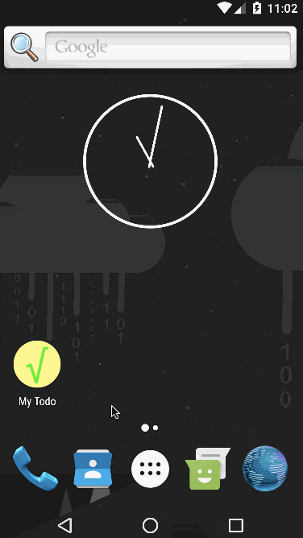
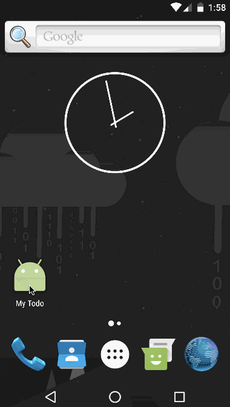

# Pre-work - *My Todo*

**My Todo** is an Android app that allows building a todo list and basic todo items management functionality including adding new items, editing and deleting an existing item.

Submitted by: **Daniel Weibel**

Time spent: :smiley: hours spent in total

## User Stories

The following **required** functionality is completed:

* [x] User can **successfully add and remove items** from the todo list
* [x] User can **tap a todo item in the list and bring up an edit screen for the todo item** and then have any changes to the text reflected in the todo list.
* [x] User can **persist todo items** and retrieve them properly on app restart

The following **optional** features are implemented:

* [x] Persist the todo items [into SQLite](http://guides.codepath.com/android/Persisting-Data-to-the-Device#sqlite) instead of a text file
* [x] Improve style of the todo items in the list [using a custom adapter](http://guides.codepath.com/android/Using-an-ArrayAdapter-with-ListView)
* [x] Add support for completion due dates for todo items (and display within listview item)
* [ ] Use a [DialogFragment](http://guides.codepath.com/android/Using-DialogFragment) instead of new Activity for editing items
* [x] Add support for selecting the priority of each todo item (and display in listview item)
* [x] Tweak the style improving the UI / UX, play with colors, images or backgrounds

The following **additional** features are implemented:

* [x] Use a fragment for the input form which is used in both the MainActivity and EditActivity
* [x] Replace the [ActionBar](https://developer.android.com/reference/android/app/ActionBar.html) by the more modern [Toolbar](https://developer.android.com/reference/android/support/v7/widget/Toolbar.html)
* [x] Set up the EditActivity as a [full-screen dialog](https://material.io/guidelines/components/dialogs.html#dialogs-full-screen-dialogs)
* [x] Save the creation date along with the other data of each item
* [x] Allow sorting the items according to several sort orders:
    * [x] By creation date ascending
    * [x] By creation date descending
    * [x] Alphabetically
    * [x] By priority
    * [x] By due date
* [x] Allow selection of multiple items ([contextual action mode](https://developer.android.com/guide/topics/ui/menus.html#CAB)) and provide the actions "Mark as Done" and "Delete" for the selected items
* [x] Archiving of done items
    * [x] Display all the items that have been marked as done in an additional activiy (ArchiveActiity) along with the date and time that they have been marked as done
    * [x] Allow "putting back" done items from the archive to the todo list, and deleting them (through the contextual action mode)
* [x] App published on Google Play ([My Todo](https://play.google.com/store/apps/details?id=org.weibeld.mytodo))

## Video Walkthrough 

Here's a walkthrough of the implemented **optional/additional** user stories:

Here's a walkthrough of the implemented **required** user stories:

GIF created with [LiceCap](http://www.cockos.com/licecap/).

## Notes

- No major difficulties encountered, the most time-consuming part is probably to get the layouts right
- Use of **Cupboard** to facilitate SQLite database management
- **Flexibility** and **rapidity** of use are the main design aims of this app:
    - The text box to enter a new item is in the main activity, ready to be used without any additional clicks
    - A priority and/or a due date may be selected for each item, but this is optional to provide more flexibility
    - Very long and multi-line items are supported
- **Ideas for next steps:**
    - Highlight overdue items in some way
    - Replace ListView in MainActivity and ArchiveActivity by [RecyclerView](https://developer.android.com/reference/android/support/v7/widget/RecyclerView.html) and add suport for "swiping" individual items right and left to "mark as done" and "delete", respectively, in MainActivity, and "put back" and "delete", respectively, in ArchiveActivity
        - Implement swiping items with [this library](https://github.com/daimajia/AndroidSwipeLayout)?
        - RecyclerView does not support multiple selection (as in contextual action mode with ListView), but there is a workaround [here](https://bignerdranch.github.io/recyclerview-multiselect/)
    - Add animations for adding, deleting, and sorting items (through the facilities of RecyclerView)
    - Add support for multiple todo lists
    - Improve colour scheme and overall design of the app

## License

    Copyright 2017 Daniel Weibel

    Licensed under the Apache License, Version 2.0 (the "License");
    you may not use this file except in compliance with the License.
    You may obtain a copy of the License at

        http://www.apache.org/licenses/LICENSE-2.0

    Unless required by applicable law or agreed to in writing, software
    distributed under the License is distributed on an "AS IS" BASIS,
    WITHOUT WARRANTIES OR CONDITIONS OF ANY KIND, either express or implied.
    See the License for the specific language governing permissions and
    limitations under the License.
